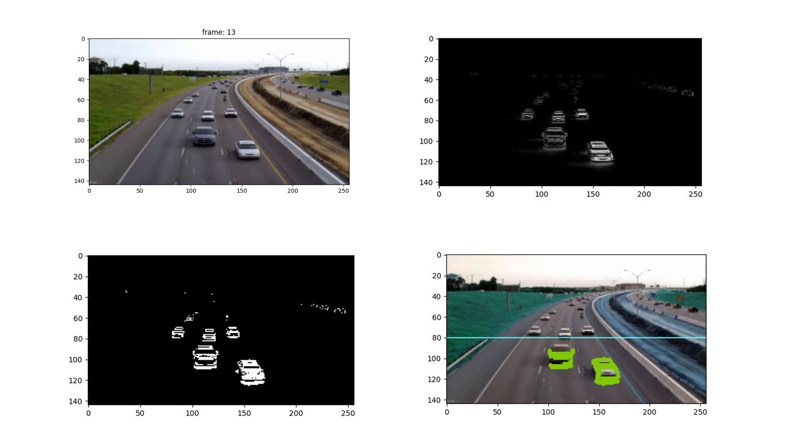

<h1 align="center"> Car-Detection</h1>




## 💻 Projeto

Desenvolvido em Python, ele utiliza da OpenCV para fazer a leitura de frames e detectar a presença de veiculos em uma certa area .

## 🎓 Tecnologias
- [Python3](https://www.python.org/)
- [OpenCV](https://opencv.org/)
- [matplotlib](https://matplotlib.org/)

## 🚀 Como executar
```
- Clone o repositório
- Execute o arquivo `.py` 
````

Feito com 💜 por Yago B. Fontoura 👋🏼 Veja meu <a href ="https://www.linkedin.com/in/yago-fontoura/">Linkedin</a> 